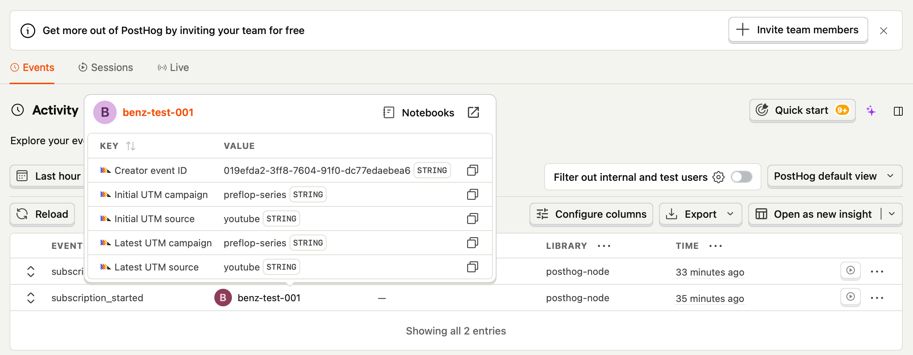

# POC Report — Marketing Analytics & Growth Insight System (PostHog)

DeepRun Website (deeprun.com) — A working proof-of-concept for the Buy-First
Marketing Analytics PRD, connected to a live PostHog project and verified end to
end. Confirms the "~1 day of engineering" claim and the buy-don't-build decision.

| Field | Value |
| --- | --- |
| Author | Benz (Engineering) |
| Updated | 2026-06-25 |
| Team | Marketing, Engineering, Analytics, Product |
| Product | DeepRun Website (deeprun.com) |
| Depends on | Marketing Analytics PRD (2026-06-07); GTM container GTM-KM659L5K |
| Approach | Buy, don't build — PostHog + Dub.co (validated) |
| Status | POC complete — verified with live PostHog data |

**TL;DR:** We built the four instrumentation points the PRD calls the only real
engineering, connected the POC to a live PostHog project, and watched a
server-side `subscription_started` arrive with its first-touch UTM intact
(youtube / preflop-series). Attribution from click to payment works; no dashboard
code was written (PostHog provides it). One correction was found for the
production webhook.

## 1. What We Built

A standalone Next.js app in `/Users/sumbenz/workspace/poc`. It implements the
entire engineering scope of the PRD (§6) and nothing more:

| PRD requirement | Implemented |
| --- | --- |
| C2 · SPA `page_view` tracker (the open gap) | yes |
| C3 · named events (sign_up, lesson_started, paywall_viewed, checkout_started) | yes |
| C4 · server-side `subscription_started` (authoritative) | yes |
| §3 · first-touch UTM carried through to payment | yes |

It runs without a PostHog key in demo mode (events mirrored on screen), so it can
be demonstrated before buying any SaaS.

## 2. Decision Validated: Buy, Don't Build

Dashboards, funnels and session replay were **not** built. PostHog ingested,
attributed and displayed our event out of the box, exactly as the PRD predicted
(§B). The engineering surface is only the four events above.

## 3. How It Works

```text
Deeplink (?utm_source=youtube)   ->  land  ->  capture first-touch UTM (localStorage)
        |                                              |
        |  named events read the UTM ------------------+
        v
client capture()  ->  PostHog (browser)
        |
        v  payment
server webhook    ->  posthog-node  ->  subscription_started (distinct_id = userId)
```

First-touch UTM is stored on the first landing and never overwritten, so a
payment days later is still credited to the original channel.

## 4. Test Result — Live PostHog Data

LIVE mode (project key configured). The server-side event appeared in
PostHog → Activity → Events within seconds:



| Field | Value | Meaning |
| --- | --- | --- |
| Event | `subscription_started` | the authoritative conversion event |
| Distinct ID | `benz-test-001` | stitches browser + server to one person |
| Library | `posthog-node` | confirms it came server-side, not the browser |
| Initial UTM source | `youtube` | first-touch attribution captured |
| Initial UTM campaign | `preflop-series` | first-touch attribution captured |

PostHog auto-mapped our UTM params onto its native **Initial UTM** person
properties — first-touch works with no extra setup.

## 5. What This Proves

| Claim in the PRD | Status after POC |
| --- | --- |
| Paid conversions attributable to a source (§7) | Proven — credited to youtube / preflop-series |
| Server-side accuracy, survives ad-blockers (§6.4) | Proven — `posthog-node` library tag |
| Buy, don't build (§2) | Proven — zero dashboard code |
| ~1 day of engineering (§6) | Realistic — only four instrumentation points |

## 6. The Only Real Engineering Work (and one correction)

The four points map directly into deeprun-frontend:

1. SPA `page_view` → `src/app/[lang]/layout.tsx`.
2. Named events → at the four UI points.
3. Server-side `subscription_started` → `src/app/api/billing/webhook/route.ts`.
4. Config/infra → CSP host + env-var pipeline (infra / P'F).

**Correction (important):** do not fire `subscription_started` on the raw
`customer.subscription.created` case (`route.ts:79`). That case also receives
unpaid (`incomplete`) subscriptions, which the webhook skips via `shouldMirror()`
(`route.ts:106`). Fire it **inside `handleSubscriptionUpsert`, after that guard**,
and dedupe so renewals / plan-changes are not recounted — otherwise conversions
inflate and the §7 "≥95% accurate" target is missed.

## 7. Limitations & Out of Scope

- Single test event so far — the funnel needs more events to render fully.
- Out of scope: cookie-consent gate, PII masking, GTM loading, production
  env-var pipeline (infra / P'F).

## 8. Rollout / Next Steps

- Seed sample events (several users / campaigns) to render a real funnel for the
  Monday walkthrough.
- On approval, port the four instrumentation points into deeprun-frontend.

## 9. Risks & Open Decisions

- PostHog cloud vs self-host — cloud ships faster; self-host gives data ownership.
- Consent / PII — opt-in vs opt-out; mask PII in session replays.
